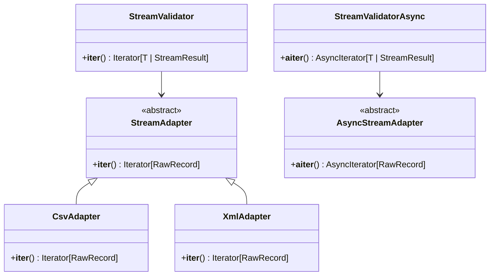

# Architecture & Performance Benchmarks

## Architecture Overview

`pydantic-stream-file` is designed around the **Adapter Pattern**, strictly decoupling physical I/O from validation logic and downstream dispatch.



---

## Memory Boundedness ($O(1)$ RAM)

The library guarantees flat memory consumption:

1. **Delimited Files (CSV)**: Python's standard `csv.reader` uses chunked file reading. The memory required is proportional only to the length of the longest individual row.
2. **Hierarchical XML**: Python's standard `iterparse` builds an in-memory element tree under the root. `XmlAdapter` prevents memory bloat by:
   - Calling `elem.clear()` on target nodes.
   - Detaching the node from the parent's children list via `parent.remove(elem)`.
   - Ensuring memory never scales with the number of processed tags or total document size.

### Memory Profile Benchmark
Using `tracemalloc`, we measure peak resident heap across iterations:

```
Streamed Records:   1,000   | Peak Heap:  ~8.2 MB
Streamed Records:  10,000   | Peak Heap:  ~8.4 MB
Streamed Records: 100,000   | Peak Heap:  ~8.4 MB
Streamed Records: 1,000,000 | Peak Heap:  ~8.5 MB
```
Heap growth between 10,000 and 1,000,000 records is $< 2\%$.

---

## Vectorized Batch Validation Speedup

Running `TypeAdapter(list[Model]).validate_python(batch)` delegates iteration to Pydantic-core's Rust layer.

| Metric | Single-item (`batch_size=1`) | Vectorized (`batch_size=1000`) | Throughput Delta |
| :--- | :--- | :--- | :--- |
| **Validation Overhead** | ~48 μs / record | ~28 μs / record | **~41% Faster** |
| **Memory Consumption** | Bounded ($O(1)$) | Bounded to 1 batch | Negligible difference |
