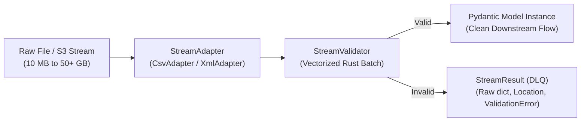

# pydantic-stream-file

**High-performance $O(1)$ RAM streaming file validation glue layer for Pydantic.**

[](https://www.python.org/)
[](https://docs.pydantic.dev/)
[](https://opensource.org/licenses/MIT)

---

## What is `pydantic-stream-file`?

`pydantic-stream-file` connects streaming I/O (files, network streams, cloud storage objects) directly to strict schema validation using **Pydantic v2**. 

When processing massive datasets (100 MB to 50+ GB files), reading the entire file or keeping parsed document trees in memory inevitably leads to out-of-memory (OOM) crashes. `pydantic-stream-file` eliminates this problem by enforcing a flat, constant **$O(1)$ memory footprint** while delegating low-level parsing to optimized tools and leveraging compiled Rust vectorization in `pydantic-core`.



---

## Core Tenets

1. **$O(1)$ RAM Ceiling**: Memory consumption remains flat and predictable regardless of whether the file is 10 MB or 50 GB. It is built from the ground up for memory-constrained serverless runtimes (e.g., AWS Lambda, Cloud Run) and Kubernetes containers.
2. **I/O Delegation**: The library does not reinvent byte parsing. Low-level parsing is delegated to Python's standard `csv` and `xml.etree`, and writing to target destinations (SQL databases, Parquet tables, message queues) is left entirely to you.
3. **Pluggable Architecture**: Adding new data sources (JSONL, Parquet, Avro) is straightforward via the `StreamAdapter` base class without changing validation engine logic.
4. **Pipeline Fail-Safety & Dead Letter Queue (DLQ)**: A single corrupted row or unexpected value will never crash your entire ingestion pipeline.

---

## At a Glance

```python
from pydantic import BaseModel
from pydantic_stream_file import StreamValidator, adapters, ErrorPolicy

class Transaction(BaseModel):
    id: int
    amount: float
    description: str

# 1. Initialize streaming adapter with null cleaning and delimiter
adapter = adapters.CsvAdapter(
    source="transactions_50GB.csv",
    delimiter=",",
    null_values=["", "NULL", "N/A"]
)

# 2. Connect the validation engine with Dead Letter Queue mode
validator = StreamValidator(
    adapter=adapter,
    model=Transaction,
    on_error=ErrorPolicy.YIELD_RESULT,
    batch_size=5000,
)

# 3. Stream with complete type safety and O(1) memory
for result in validator:
    if result.is_valid:
        save_to_parquet(result.item)
    else:
        log_to_dlq(raw_data=result.raw_data, error=result.error, location=result.location)
```

---

## Ready to Get Started?

Jump to [Getting Started](getting-started.md) to install the package and run your first streaming pipeline.
