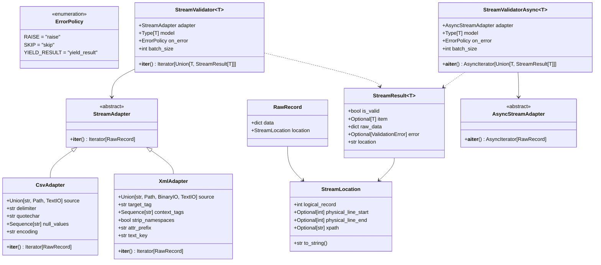

# Data Model: `pydantic-stream-file`

**Feature**: `001-stream-file-validation`  
**Date**: 2026-09-19  

## 1. Domain Entities & Type Definitions

---

## 2. Entity Specifications

### 2.1. `ErrorPolicy` (Enum)
Defines the behavior of the stream engine when a record fails schema validation or encounters an adapter parsing error.

- `RAISE = "raise"`: Default policy. Immediately halts the generator and raises the offending `ValidationError` or I/O error.
- `SKIP = "skip"`: Silently drops inconsistent or malformed records. The iterator yields only successfully validated Pydantic model instances (`T`).
- `YIELD_RESULT = "yield_result"`: Implements the Dead Letter Queue (DLQ) pattern. The iterator always yields `StreamResult[T]` instances for every single record, allowing calling code to branch into processing and error-routing pipelines.

---

### 2.2. `StreamLocation` (Value Object)
Captures precise positional metadata from the underlying stream source for diagnostics, logging, and DLQ routing.

| Field | Type | Description |
| :--- | :--- | :--- |
| `logical_record` | `int` | 1-indexed logical record number in the stream. |
| `physical_line_start` | `Optional[int]` | Physical line number in the source file where the record began (CSV). |
| `physical_line_end` | `Optional[int]` | Physical line number in the source file where the record ended (multiline CSV). |
| `xpath` | `Optional[str]` | Structural hierarchy path or tag descriptor (XML). |

**Methods:**
- `__str__() -> str`: Human-readable location description (e.g., `"Line: 420"` or `"Lines: 420-423 (Record: 395)"` or `"XPath: /catalog/item[12]"`).

---

### 2.3. `RawRecord` (Internal DTO)
Intermediary record emitted by adapters to the validation engine.

| Field | Type | Description |
| :--- | :--- | :--- |
| `data` | `dict[str, Any]` | Extracted key-value dictionary ready for schema validation. |
| `location` | `StreamLocation` | Coordinate metadata within the source stream. |

---

### 2.4. `StreamResult[T]` (Generic Data Model)
Result envelope yielded by `StreamValidator` when operating in `on_error="yield_result"` mode.

| Field | Type | Description |
| :--- | :--- | :--- |
| `is_valid` | `bool` | `True` if the record conforms to the model; `False` otherwise. |
| `item` | `Optional[T]` | Successfully validated Pydantic model instance; `None` if invalid. |
| `raw_data` | `dict[str, Any]` | The original, unaltered dictionary from the source adapter. |
| `error` | `Optional[ValidationError]` | Original Pydantic validation error; `None` if valid. |
| `location` | `str` | Stringified representation of the record's stream coordinates. |

**Invariants:**
- If `is_valid == True`: `item` is non-null, and `error` is `None`.
- If `is_valid == False`: `item` is `None`, and `error` is non-null.

---

### 2.5. `CsvAdapter` (Adapter Entity)
Sync stream adapter for delimited text files.

| Configuration Field | Type | Default | Description |
| :--- | :--- | :--- | :--- |
| `source` | `str \| Path \| TextIO` | *Required* | File path or text stream object. |
| `delimiter` | `str` | `","` | Delimiter character. |
| `quotechar` | `str` | `'"'` | Quote enclosing character. |
| `null_values` | `Sequence[str]` | `("", "NULL", "N/A")` | Sentinel string values coerced to `None`. |
| `encoding` | `str` | `"utf-8"` | File text encoding. |

---

### 2.6. `XmlAdapter` (Adapter Entity)
Sync stream adapter for hierarchical XML feeds operating with constant memory pruning.

| Configuration Field | Type | Default | Description |
| :--- | :--- | :--- | :--- |
| `source` | `str \| Path \| BinaryIO \| TextIO` | *Required* | File path or stream object. |
| `target_tag` | `str` | *Required* | Tag name of elements to extract as records. |
| `context_tags` | `Sequence[str]` | `()` | Ancestor tags whose attributes are injected into target records. |
| `strip_namespaces`| `bool` | `True` | Strip XML namespace URLs from tag names. |
| `attr_prefix` | `str` | `"@"` | Prefix applied to XML attribute keys. |
| `text_key` | `str` | `"#text"` | Dict key used for element inner text when attributes exist. |

---

### 2.7. `StreamValidator[T]` & `StreamValidatorAsync[T]` (Engines)

| Parameter | Type | Default | Description |
| :--- | :--- | :--- | :--- |
| `adapter` | `StreamAdapter \| AsyncStreamAdapter` | *Required* | Source adapter providing raw records. |
| `model` | `type[T] \| TypeAdapter[T]` | *Required* | Target Pydantic model class or TypeAdapter (e.g. union). |
| `on_error` | `ErrorPolicy \| str` | `"raise"` | Error handling policy (`raise`, `skip`, `yield_result`). |
| `batch_size` | `int` | `1000` | Number of records validated per vectorized batch. |
