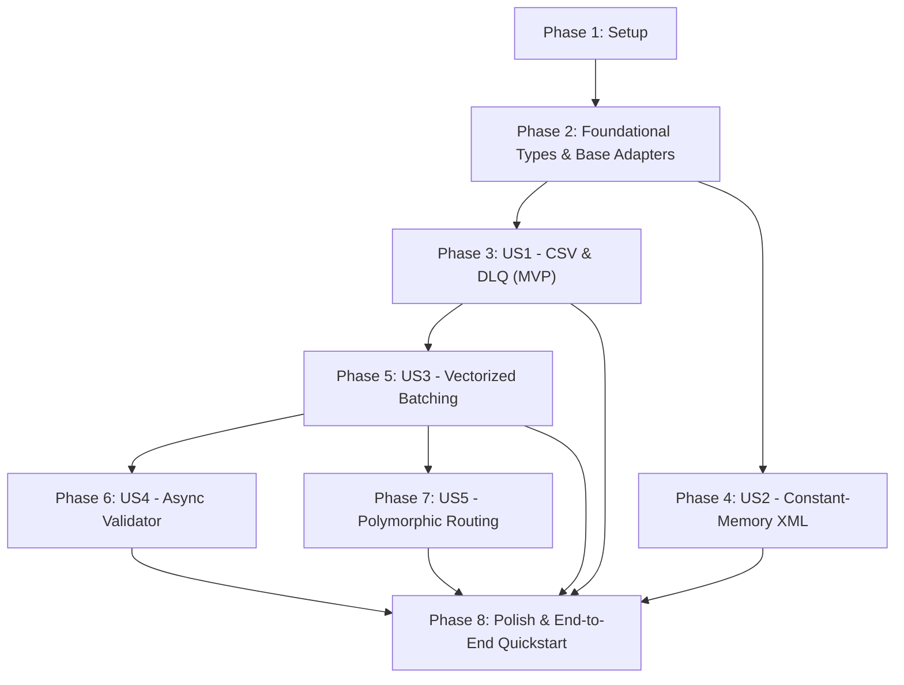

# Tasks: Stream File Validation (`pydantic-stream-file`)

**Feature**: `001-stream-file-validation`  
**Plan**: [plan.md](plan.md) | **Spec**: [spec.md](spec.md)

## Phase 1: Setup (Shared Infrastructure)

**Purpose**: Project initialization and basic structure

- [X] T001 Initialize Python project configuration and dependencies in pyproject.toml
- [X] T002 Create package source and test directory hierarchy per implementation plan
- [X] T003 [P] Add PEP 561 typing marker in src/pydantic_stream_file/py.typed
- [X] T004 [P] Configure shared pytest fixtures and test helpers in tests/conftest.py

---

## Phase 2: Foundational (Blocking Prerequisites)

**Purpose**: Core domain types and abstractions that MUST be complete before ANY user story can be implemented

**⚠️ CRITICAL**: No user story work can begin until this phase is complete

- [X] T005 Implement ErrorPolicy enum, StreamLocation dataclass, and StreamResult generic model in src/pydantic_stream_file/types.py
- [X] T006 [P] Implement abstract base adapters StreamAdapter and AsyncStreamAdapter in src/pydantic_stream_file/adapters/base.py
- [X] T007 [P] Implement StreamLocation string formatting and StreamResult invariants unit tests in tests/unit/test_types.py
- [X] T008 [P] Implement StreamLocation line and XPath coordinate unit tests in tests/unit/test_location.py

**Checkpoint**: Core type foundation complete — user story implementation can now begin

---

## Phase 3: User Story 1 - Flat-File (CSV) Streaming with Dead Letter Queue Routing (Priority: P1) 🎯 MVP

**Goal**: Stream delimited flat files with multiline support, sentinel null conversion, line tracking, and flexible error policies (RAISE, SKIP, YIELD_RESULT) for Dead Letter Queue routing.

**Independent Test**: Process a CSV file containing valid records, multiline quoted fields, and malformed rows; verify valid records yield Pydantic instances, malformed records yield StreamResult DLQ envelopes with raw dictionaries and line locations in YIELD_RESULT mode, and memory remains flat.

### Tests for User Story 1 ⚠️

- [X] T009 [P] [US1] Unit tests for CSV delimiter parsing, multiline buffering, and sentinel coercion in tests/unit/test_csv_adapter.py
- [X] T010 [P] [US1] Integration tests for StreamValidator RAISE, SKIP, and YIELD_RESULT error policies in tests/integration/test_stream_validator.py

### Implementation for User Story 1

- [X] T011 [P] [US1] Implement sentinel value cleaning and null coercion helpers in src/pydantic_stream_file/utils.py
- [X] T012 [US1] Implement CsvAdapter with multiline cell buffering and line number tracking in src/pydantic_stream_file/adapters/csv.py
- [X] T013 [US1] Implement core StreamValidator engine with single-record processing and policy dispatch in src/pydantic_stream_file/engine.py
- [X] T014 [US1] Export CsvAdapter in src/pydantic_stream_file/adapters/__init__.py
- [X] T015 [US1] Export StreamValidator, StreamResult, and ErrorPolicy in src/pydantic_stream_file/__init__.py

**Checkpoint**: User Story 1 is fully functional and testable independently as the project MVP.

---

## Phase 4: User Story 2 - Memory-Bounded Hierarchical XML Stream Extraction & Validation (Priority: P1)

**Goal**: Extract nested XML tags into validated models with attribute prefixing (@), text normalization, repeated child collection, parent context attribute injection, and constant memory ($O(1)$ RAM) pruning.

**Independent Test**: Process a multi-gigabyte or large XML feed with nested elements and parent metadata under strict memory limits; verify parent context is injected into all child records and resident memory remains flat.

### Tests for User Story 2 ⚠️

- [X] T016 [P] [US2] Unit tests for XML subtree pruning, parent context extraction, and namespace stripping in tests/unit/test_xml_adapter.py
- [X] T017 [P] [US2] Memory benchmark test verifying constant O(1) RAM consumption during XML streaming in tests/benchmarks/test_memory_profile.py

### Implementation for User Story 2

- [X] T018 [P] [US2] Implement XML node-to-dict converter with attribute prefixes (@), text keys (#text), and repeated tag lists in src/pydantic_stream_file/adapters/xml.py
- [X] T019 [US2] Implement parent context tracking stack and attribute inheritance in src/pydantic_stream_file/adapters/xml.py
- [X] T020 [US2] Implement XmlAdapter with iterparse and parent-reference cleanup in src/pydantic_stream_file/adapters/xml.py
- [X] T021 [US2] Export XmlAdapter in src/pydantic_stream_file/adapters/__init__.py

**Checkpoint**: User Stories 1 and 2 are functional and testable independently.

---

## Phase 5: User Story 3 - High-Throughput Vectorized Validation & Batching (Priority: P2)

**Goal**: Vectorize schema validation using TypeAdapter batching in Pydantic's Rust core, isolating errors by index to maintain per-item Dead Letter Queue results with significant throughput gains.

**Independent Test**: Run validation on 100,000 records comparing batch_size=1 vs batch_size=5000; verify a >=30% speedup and verify that mixed valid/invalid batches correctly attribute errors and raw data to failed items.

### Tests for User Story 3 ⚠️

- [X] T022 [P] [US3] Integration tests for batch validation error-index attribution and trailing batch flush in tests/integration/test_batching.py
- [X] T023 [P] [US3] Throughput benchmark test asserting >=30% speedup with batching in tests/benchmarks/test_batch_throughput.py

### Implementation for User Story 3

- [X] T024 [US3] Implement vectorized batch validation via TypeAdapter(list[Model]) in src/pydantic_stream_file/engine.py
- [X] T025 [US3] Implement batch error index extraction and fallback item-level error isolation in src/pydantic_stream_file/engine.py
- [X] T026 [US3] Implement trailing partial batch flushing at end of stream in src/pydantic_stream_file/engine.py

**Checkpoint**: Batching and vectorized error isolation operational across all adapters.

---

## Phase 6: User Story 4 - Non-Blocking Asynchronous Stream Validation (Priority: P3)

**Goal**: Provide an asynchronous validator (StreamValidatorAsync) that consumes async stream adapters without blocking the event loop, ensuring parity with the synchronous engine.

**Independent Test**: Stream data asynchronously using async for; verify identical records, ordering, and errors are produced compared to synchronous StreamValidator.

### Tests for User Story 4 ⚠️

- [X] T027 [P] [US4] Integration tests for StreamValidatorAsync parity with synchronous validator in tests/integration/test_async_parity.py

### Implementation for User Story 4

- [X] T028 [US4] Implement StreamValidatorAsync using shared batch validation logic in src/pydantic_stream_file/engine.py
- [X] T029 [US4] Export StreamValidatorAsync in src/pydantic_stream_file/__init__.py

**Checkpoint**: Synchronous and asynchronous validation interfaces achieve full feature parity.

---

## Phase 7: User Story 5 - Polymorphic Event Stream Multiplexing (Priority: P3)

**Goal**: Support validating heterogeneous streams against discriminated unions or union models, dynamically routing records to appropriate types.

**Independent Test**: Stream records with different event types and a discriminator field; verify each item resolves to its specific model variant.

### Tests for User Story 5 ⚠️

- [X] T030 [P] [US5] Integration tests for discriminated union validation and invalid event routing in tests/integration/test_polymorphic.py

### Implementation for User Story 5

- [X] T031 [US5] Support TypeAdapter union and discriminated union handling in src/pydantic_stream_file/engine.py

**Checkpoint**: All 5 user stories are functional and independently testable.

---

## Phase 8: Polish & Cross-Cutting Concerns

**Purpose**: Verification, documentation, and quality gates across the entire library

- [X] T032 [P] Implement end-to-end quickstart validation scenarios from quickstart.md in tests/integration/test_quickstart.py
- [X] T033 [P] Add complete API reference and README.md with quickstart examples in README.md
- [X] T034 Run full test suite, type checking, and verify all success criteria

---

## Dependencies & Execution Order

### Phase Dependencies

- **Setup (Phase 1)**: No dependencies — can start immediately.
- **Foundational (Phase 2)**: Depends on Setup (Phase 1) — BLOCKS all user stories.
- **User Story 1 (Phase 3)**: Depends on Foundational (Phase 2). Forms the core MVP.
- **User Story 2 (Phase 4)**: Depends on Foundational (Phase 2). Can execute in parallel with US1.
- **User Story 3 (Phase 5)**: Depends on User Story 1 (Phase 3) engine structure.
- **User Story 4 (Phase 6)**: Depends on User Story 3 (Phase 5) engine structure.
- **User Story 5 (Phase 7)**: Depends on User Story 3 (Phase 5) engine structure.
- **Polish (Phase 8)**: Depends on all desired user stories being completed.

---

## Parallel Execution Opportunities

- **Phase 1**: T003 (`py.typed`) and T004 (`conftest.py`) can run in parallel after T001 and T002.
- **Phase 2**: T006 (`base.py`), T007 (`test_types.py`), and T008 (`test_location.py`) can run in parallel once T005 is defined.
- **User Story 1**: T009 (`test_csv_adapter.py`) and T010 (`test_stream_validator.py`) can be written in parallel (TDD).
- **User Story 2**: Can be implemented in parallel with User Story 1 once Phase 2 is complete.
- **User Story 3**: T022 (`test_batching.py`) and T023 (`test_batch_throughput.py`) can run in parallel.
- **Polish Phase**: T032 (`test_quickstart.py`) and T033 (`README.md`) can run in parallel.

---

## Implementation Strategy

### MVP First (User Story 1 Only)
1. Complete **Phase 1: Setup** (T001–T004).
2. Complete **Phase 2: Foundational** (T005–T008).
3. Complete **Phase 3: User Story 1** (T009–T015).
4. **STOP and VALIDATE**: Run `pytest tests/unit/test_csv_adapter.py tests/integration/test_stream_validator.py`.
5. Deliver working CSV streaming with Dead Letter Queue routing as MVP!

### Incremental Delivery
1. Foundation + US1 $\rightarrow$ Working CSV streamer with DLQ (MVP).
2. Add US2 $\rightarrow$ Constant-memory XML streaming with parent context.
3. Add US3 $\rightarrow$ Vectorized batching with 30%+ speedup and error isolation.
4. Add US4 $\rightarrow$ Non-blocking async streaming for FastAPI/S3.
5. Add US5 $\rightarrow$ Polymorphic event routing with discriminated unions.
6. Polish $\rightarrow$ Quickstart validation, documentation, and full verification.
